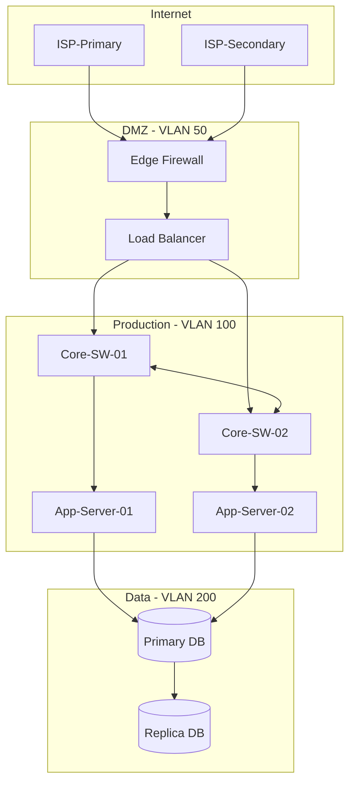

# Module 9: Network Documentation & CMDB

## Table of Contents

1. [Introduction](#1-introduction)
2. [Network Diagram Standards](#2-network-diagram-standards)
3. [Diagramming Tools and Selection](#3-diagramming-tools-and-selection)
4. [Cable Management and Structured Cabling](#4-cable-management-and-structured-cabling)
5. [Port Mapping and Discovery](#5-port-mapping-and-discovery)
6. [As-Built Documentation](#6-as-built-documentation)
7. [Audit Readiness and Compliance](#7-audit-readiness-and-compliance)
8. [Documentation-as-Code](#8-documentation-as-code)
9. [CMDB for Network Infrastructure](#9-cmdb-for-network-infrastructure)
10. [The Documentation Decay Problem](#10-the-documentation-decay-problem)
11. [Templates and Examples](#11-templates-and-examples)
12. [Source Index and Citations](#12-source-index-and-citations)

---

## 1. Introduction

Network documentation is the single most neglected discipline in network operations. Organizations invest millions in redundant hardware, sophisticated monitoring, and skilled engineers — then undermine all of it by running on diagrams that were last updated during the previous administration, cable labels that have faded past legibility, and a CMDB that everyone knows is wrong but nobody has time to fix.

The cost of poor network documentation is not theoretical. When an outage strikes at 2 AM, the on-call engineer's first action is to pull up a network diagram. If that diagram shows a topology from two years ago, the engineer is debugging blind. When a compliance auditor requests evidence of network segmentation for PCI-DSS, and the only current diagram is a whiteboard photograph from a planning meeting, the audit finding writes itself. When a cable is accidentally unplugged in a rack and there are no labels, a five-second fix becomes a thirty-minute trace.

This module addresses the full lifecycle of network documentation: what to document, how to diagram it, what standards govern physical cabling, how to maintain a Configuration Management Database (CMDB) as a network source of truth, how to survive compliance audits, and — most critically — how to prevent the inevitable decay that renders documentation useless within months of creation.

The operational philosophy is straightforward: documentation that is not maintained is worse than no documentation at all, because stale documentation creates false confidence. Every practice in this module includes a maintenance strategy alongside the creation process.

**Who should read this module:**

- Network engineers responsible for creating and maintaining network diagrams
- NOC analysts who rely on documentation during incident response
- IT managers establishing documentation standards and review cadences
- Compliance auditors evaluating network documentation against regulatory requirements
- Infrastructure architects designing documentation workflows for new deployments

**What this module does not cover:**

- Network design methodology (covered in SNE — Systems Network Engineering)
- Monitoring and alerting configuration (covered in Module 01)
- Change management procedures (covered in Module 02)
- Specific vendor CLI commands for configuration backup

---

## 2. Network Diagram Standards

Network diagrams are not a single artifact. A complete documentation set requires multiple diagram types, each serving a different audience and answering different operational questions. The common failure is producing one "network diagram" that attempts to show everything — physical cabling, IP addressing, VLAN assignments, firewall rules, and application flows — on a single cluttered page that communicates nothing effectively.

### 2.1 Layer 1: Physical Diagrams

Physical diagrams answer: *what hardware exists, where is it located, and what is physically connected to what?*

**Required elements:**

| Element | Description | Example |
|---------|-------------|---------|
| Device placement | Rack unit position for every device | Switch-Core-01 in Rack A3, U22-U23 |
| Cable runs | Physical cable paths between devices | Trunk 4 from Rack A3 to Rack B1 via Tray 7 |
| Port assignments | Specific interface on each end of a connection | Gi1/0/24 to Gi2/0/1 |
| Cable type and color | Media type and organizational color scheme | OM4 fiber, orange jacket = inter-rack trunk |
| Patch panels | Patch panel positions and port mappings | Panel A3-PP1, Port 12 to Switch-Core-01 Gi1/0/12 |
| Power circuits | UPS and PDU connections per device | PDU-A3-Left, Outlet 8; PDU-A3-Right, Outlet 8 |
| Rack elevations | Front and rear views of each rack | 42U rack, devices shown in position with blank panels |

**Best practice:** Physical diagrams should resemble the physical reality. Use rack elevation diagrams for individual racks and floor plans for data center layouts. Color-code cable types consistently. Include a legend on every diagram.

**Common failure:** Drawing logical connections on a physical diagram. A physical diagram that shows "VLAN 100" on a cable is mixing abstraction layers. The cable does not know what VLAN it carries — that information belongs on the Layer 2 diagram.

### 2.2 Layer 2: Logical Diagrams

Logical diagrams at Layer 2 answer: *how are devices grouped, how do VLANs span the topology, where are the trunk links, and what does the spanning tree look like?*

**Required elements:**

| Element | Description | Example |
|---------|-------------|---------|
| VLAN topology | VLAN IDs, names, and which switches participate | VLAN 100 (Servers) on Core-01, Core-02, Access-01 |
| Trunk links | 802.1Q trunks between switches with allowed VLANs | Trunk: Core-01 Po1 to Core-02 Po1 (VLANs 100,200,300) |
| STP topology | Root bridge, designated ports, blocked ports | Core-01 is root for VLAN 100, Access-03 Gi0/2 blocking |
| Link aggregation | Port-channel/LAG membership and LACP status | Po1: Gi1/0/23 + Gi1/0/24, LACP active |
| Native VLAN | Untagged VLAN on each trunk | Native VLAN 999 (unused) on all trunks |
| MAC learning domains | Broadcast domain boundaries | VLAN 100 = one broadcast domain spanning 4 switches |

**Best practice:** Show STP topology explicitly. The most dangerous network documentation gap is not knowing which links are in blocking state. When a root bridge election changes unexpectedly, the Layer 2 diagram is the reference for what the topology should look like.

### 2.3 Layer 3: Routing Diagrams

Layer 3 diagrams answer: *what subnets exist, how are they connected, what routing protocols govern path selection, and where do routing domains meet?*

**Required elements:**

| Element | Description | Example |
|---------|-------------|---------|
| Subnets | CIDR notation for every subnet | 10.1.100.0/24 (Server VLAN 100) |
| Router/L3 switch interfaces | IP address on every routed interface | Core-01 SVI 100: 10.1.100.1/24 |
| Routing protocol domains | OSPF areas, BGP AS numbers, EIGRP domains | OSPF Area 0 backbone, Area 1 branch offices |
| VRF instances | VRF names and route distinguishers | VRF:PRODUCTION, RD 65000:100 |
| Static routes | Non-protocol routes with next hop | 0.0.0.0/0 via 203.0.113.1 (ISP gateway) |
| NAT boundaries | Where NAT translation occurs | Edge firewall: inside 10.0.0.0/8 to outside 203.0.113.0/28 |
| Default gateways | First-hop redundancy (VRRP/HSRP) | HSRP VIP: 10.1.100.1, Active: Core-01, Standby: Core-02 |

### 2.4 Application Flow Diagrams

Application flow diagrams answer: *how does traffic move between application tiers, what protocols and ports are used, and where do security controls intersect the flow?*

**Required elements:**

| Element | Description | Example |
|---------|-------------|---------|
| Application tiers | Client, web, app, database, external API | User browser to Load Balancer to App Server to Database |
| Protocols and ports | TCP/UDP, port numbers, encryption | HTTPS/443, gRPC/8443, PostgreSQL/5432 |
| Firewall traversals | Which firewalls or ACLs traffic crosses | FW-Edge allows HTTPS inbound, FW-Internal allows App-to-DB |
| Load balancer placement | VIP, backend pools, health check paths | VIP 10.1.200.10:443, pool: app-01 through app-04 |
| Data classification | Sensitivity of data in transit | PII in transit between App and DB (encrypted with TLS 1.3) |

**Best practice:** Application flow diagrams should be created per application or service, not as a single enterprise-wide diagram. They are the primary artifact for firewall rule justification and compliance evidence.

---

## 3. Diagramming Tools and Selection

### 3.1 Tool Comparison

| Tool | Cost | Strengths | Weaknesses | Best For |
|------|------|-----------|------------|----------|
| draw.io / diagrams.net | Free (open source) | No cost, offline capable, git-friendly XML format, extensive shape libraries, integrates with Confluence/GitHub | No real-time collaboration in desktop version, limited auto-layout | Teams on a budget, diagrams stored alongside code |
| Microsoft Visio | $280-520/year (enterprise license) | Enterprise standard, extensive stencil ecosystem, integration with SharePoint/Teams, familiar to non-technical stakeholders | Windows-only desktop app, expensive, XML format difficult to diff in git | Large enterprises with existing Microsoft licensing |
| Lucidchart | $7.95-9/user/month | Real-time collaboration, cloud-native, import/export Visio, automated diagramming with network data import | Subscription cost, data stored in vendor cloud, limited offline capability | Distributed teams needing real-time collaboration |
| NetBox topology views | Free (plugin for NetBox) | Auto-generated from CMDB data, always reflects current state, filterable by site/role/tag | Requires NetBox deployment, limited layout control, read-only visualization | Teams already running NetBox as source of truth |
| Mermaid | Free (open source) | Renders in Markdown (GitHub, GitLab, Confluence), version-controllable text, CI/CD integration | Limited layout control, no drag-and-drop, poor for complex physical diagrams | Documentation-as-code workflows, README diagrams |
| D2 | Free (open source) | Purpose-built DSL for diagrams, superior layout engine (dagre/ELK), network topology support, exportable SVG | Smaller community than Mermaid, separate rendering step needed | Engineers who want Mermaid-like text but better layout |

### 3.2 Selection Decision Framework

**Use draw.io when:** The team needs a free, general-purpose tool that can produce any diagram type. Draw.io's XML format can be stored in git, though diffs are not human-readable. This is the default recommendation for most organizations.

**Use Visio when:** The organization has existing Microsoft enterprise licensing, stakeholders expect Visio files, and diagrams are managed in SharePoint. Do not purchase Visio solely for network diagrams — draw.io covers the same use cases at no cost.

**Use NetBox topology views when:** The organization runs NetBox and wants diagrams that automatically reflect the current device and cable inventory. This eliminates manual diagram maintenance for the physical and logical layers but does not replace hand-crafted application flow diagrams.

**Use D2 or Mermaid when:** Diagrams must live in git, render in documentation pipelines, and be reviewed in pull requests alongside code changes. D2 is the better choice for network topologies due to its hierarchical layout engine. Mermaid is the better choice when the primary rendering target is GitHub or GitLab Markdown.

### 3.3 Mermaid Network Diagram Example



### 3.4 D2 Network Diagram Example

```d2
direction: down

internet: Internet {
  isp-primary: ISP-Primary
  isp-secondary: ISP-Secondary
}

dmz: DMZ (VLAN 50) {
  firewall: Edge Firewall {
    shape: hexagon
  }
  load-balancer: Load Balancer
}

production: Production (VLAN 100) {
  core-01: Core-SW-01
  core-02: Core-SW-02
  core-01 <-> core-02: LACP Po1
}

internet.isp-primary -> dmz.firewall: BGP
internet.isp-secondary -> dmz.firewall: BGP
dmz.firewall -> dmz.load-balancer: HTTPS/443
dmz.load-balancer -> production.core-01: VLAN 100
dmz.load-balancer -> production.core-02: VLAN 100
```

---

## 4. Cable Management and Structured Cabling

### 4.1 TIA-568 and TIA-606 Standards

Two TIA standards govern structured cabling and its administration:

**TIA-568 (Telecommunications Cabling Standard)** defines the physical infrastructure — cable categories, connector types, maximum distances, and testing requirements. The current revision is TIA-568-E (published 2020), which covers Category 5e, 6, 6A, and 8 copper cabling as well as OM3, OM4, OM5, and OS2 fiber specifications.

**TIA-606-C (Administration Standard for Telecommunications Infrastructure)** defines how cabling is labeled, documented, and tracked. This is the standard that directly governs documentation practices. TIA-606-C establishes four administration classes based on infrastructure complexity:

| Class | Scope | Typical Environment |
|-------|-------|---------------------|
| 1 | Single building, single telecommunications room | Small office, single server closet |
| 2 | Single building, multiple telecommunications rooms | Medium office building |
| 3 | Campus with multiple buildings | University, corporate campus |
| 4 | Multi-campus or multi-site | Enterprise with multiple geographic locations |

Higher classes require more granular labeling and documentation. Class 1 requires link identifiers at each end. Class 4 requires globally unique identifiers that encode site, building, floor, room, rack, panel, and port.

### 4.2 Cable Labeling Schemes

TIA-606-C requires every cable to be labeled at both ends, within 300 mm (12 inches) of the termination point. Labels must be machine-generated (not handwritten) and meet legibility and adhesion standards per UL 969.

**Recommended labeling format (Class 3):**

```
{Building}-{Floor}-{Room}-{Rack}-{Panel}-{Port}
```

**Example:** `HQ-2-MDF-A3-PP1-12` means Headquarters building, floor 2, Main Distribution Frame, rack A3, patch panel 1, port 12.

**Labeling rules:**

- Use consistent abbreviations documented in a legend
- Apply labels at both ends of every cable (the panel end and the device end)
- Include cable type on the label when mixed media exists in the same pathway (e.g., "CAT6A" or "OM4")
- Use sequential numbering that allows for expansion (leave gaps in the sequence rather than renumbering when adding cables)
- Replace labels immediately when they become illegible

### 4.3 Cable Color Coding

Color coding by function reduces errors during physical maintenance. There is no universal mandatory standard, but the following scheme is widely adopted in enterprise data centers:

| Color | Function | Rationale |
|-------|----------|-----------|
| Blue | Horizontal copper (station cables) | TIA-606 traditional default for horizontal |
| Orange | Multimode fiber (OM1/OM2/OM3/OM4) | Industry convention, matches jacket color |
| Yellow | Single-mode fiber (OS2) | Industry convention, matches jacket color |
| Green | Network management / out-of-band | Visually distinct, signifies console/IPMI |
| Red | Critical infrastructure / power | Universal warning color, used for UPS/PDU circuits |
| White | Backbone copper (building risers) | Contrasts with blue horizontal runs |
| Purple/Violet | VoIP or converged infrastructure | Distinguishes voice traffic from data |
| Black | ISP/WAN handoff cables | Clearly identifies carrier demarcation |

**Important:** Document the color scheme and post the legend in every telecommunications room. A color scheme that exists only in one engineer's memory provides no operational value.

### 4.4 Patch Panel Documentation

Every patch panel port requires a documented mapping to its far-end termination. This mapping is maintained in a patch panel schedule:

```
Patch Panel: HQ-2-MDF-A3-PP1
Panel Type: Cat6A, 48-port, Keystone
Installed: 2025-03-15
Rack: A3, U40

Port | Cable ID         | Far End                    | Status   | Device Port
-----|------------------|----------------------------|----------|------------------
01   | HQ-2-MDF-A3-C001 | HQ-2-IDF-B1-PP1-01        | Active   | Access-SW-01 Gi0/1
02   | HQ-2-MDF-A3-C002 | HQ-2-IDF-B1-PP1-02        | Active   | Access-SW-01 Gi0/2
03   | HQ-2-MDF-A3-C003 | HQ-2-IDF-B1-PP1-03        | Active   | Access-SW-01 Gi0/3
...
47   | HQ-2-MDF-A3-C047 | (spare)                    | Reserved | —
48   | HQ-2-MDF-A3-C048 | (spare)                    | Reserved | —
```

### 4.5 Cable Run Tracking

For Class 3 and Class 4 installations, track each cable run as a discrete record:

| Field | Purpose | Example |
|-------|---------|---------|
| Cable ID | Unique identifier | HQ-2-MDF-A3-C001 |
| Cable type | Media specification | Cat6A U/UTP |
| Length | Measured or estimated | 42 meters |
| Pathway | Physical route taken | Tray 7, riser shaft 2, tray 12 |
| Near end | Termination A | HQ-2-MDF-A3-PP1-01 |
| Far end | Termination B | HQ-2-IDF-B1-PP1-01 |
| Install date | When the cable was installed | 2025-03-15 |
| Tested | Pass/fail and date | Pass, 2025-03-15, Fluke DSX2-8000 |
| Test report | Reference to saved test result | HQ-2-MDF-A3-C001.pdf |

---

## 5. Port Mapping and Discovery

### 5.1 Switch Port to Device Mapping

Every access port on every switch should have a documented assignment: what device is connected, what VLAN it belongs to, and what its operational purpose is. This mapping is the first artifact an engineer consults during incident response.

**Port map format:**

```
Switch: Access-SW-01 (10.1.1.11)
Location: HQ-2-IDF-B1, Rack B1, U22
Model: Cisco C9300-48P

Port     | VLAN | Mode   | Description          | Connected Device    | MAC Address
---------|------|--------|----------------------|---------------------|------------------
Gi1/0/1  | 100  | Access | Server-Web-01 eth0   | Server-Web-01       | aa:bb:cc:11:22:33
Gi1/0/2  | 100  | Access | Server-Web-02 eth0   | Server-Web-02       | aa:bb:cc:11:22:34
Gi1/0/3  | 200  | Access | Server-DB-01 eth0    | Server-DB-01        | aa:bb:cc:22:33:44
...
Gi1/0/47 | —    | Trunk  | Uplink to Core-01    | Core-SW-01 Gi1/0/1  | (trunk)
Gi1/0/48 | —    | Trunk  | Uplink to Core-02    | Core-SW-02 Gi1/0/1  | (trunk)
```

### 5.2 Automated Discovery with LLDP and CDP

Manual port mapping does not scale. Link Layer Discovery Protocol (LLDP, IEEE 802.1AB) and Cisco Discovery Protocol (CDP) enable switches and connected devices to advertise their identity to directly connected neighbors, allowing automated topology mapping.

**LLDP** is the open standard, supported by all major vendors (Cisco, Juniper, Arista, HP/Aruba, Dell). Every device with LLDP enabled advertises its system name, port description, management address, VLAN membership, and capabilities. LLDP operates at Layer 2 — it discovers only directly connected neighbors.

**CDP** is Cisco-proprietary, providing the same neighbor discovery function within Cisco environments. CDP includes additional Cisco-specific data like VTP domain, native VLAN, and power negotiation for PoE.

**Operational recommendations:**

- Enable LLDP on all switches and routers. It is disabled by default on many platforms.
- Use CDP alongside LLDP in Cisco environments for the additional data fields.
- Disable both LLDP and CDP on ports facing untrusted networks (user access ports in high-security zones). These protocols leak topology information to connected devices.
- Collect LLDP/CDP neighbor tables on a scheduled basis (daily) and compare against documented port maps to detect undocumented changes.

**Discovery tools that consume LLDP/CDP data:**

| Tool | Type | Method |
|------|------|--------|
| NetBox + device polling | Open source | NAPALM/Nornir scripts query LLDP tables, populate NetBox |
| Auvik | Commercial SaaS | SNMP + LLDP + CDP + ARP for automatic topology |
| JDisc Discovery | Commercial | LLDP + CDP + MAC tables for topology diagrams |
| Secure Cartography | Open source | SSH + SNMP for CDP/LLDP crawling, generates topology maps |
| LibreNMS | Open source | SNMP-based discovery, stores LLDP/CDP neighbors |

### 5.3 Port Utilization Tracking

Beyond knowing what is connected to each port, track port utilization rates to support capacity planning (see Module 06) and to identify waste:

| Metric | Source | Action Threshold |
|--------|--------|------------------|
| Total ports vs. connected ports | SNMP ifOperStatus | Below 40% utilization: consider consolidation |
| PoE budget consumed vs. available | SNMP PoE MIB | Above 80%: plan for additional PoE capacity |
| Unused ports with active config | Config audit | Ports configured but disconnected >90 days: reclaim |
| Trunk port utilization | Interface counters | Sustained >70% throughput: plan upgrade |

---

## 6. As-Built Documentation

### 6.1 Design vs. As-Built

A network design document describes what should be built. An as-built document describes what was actually built. These are never identical. During deployment, engineers make field decisions — different rack positions due to clearance issues, substitute cable lengths, revised VLAN numbering to avoid conflicts with existing infrastructure, adjusted routing metrics based on actual latency measurements.

The as-built document is the authoritative record. After deployment is complete, the design document is historical reference. Any troubleshooting, maintenance, or audit activity uses the as-built.

### 6.2 Red-Line Drawings

The traditional method for creating as-built documentation is the red-line process:

1. Print (or digitally annotate) the original design diagrams
2. During deployment, mark every deviation in red — changed port assignments, different cable routing, modified IP addresses, added devices, removed devices
3. After deployment, a documentation engineer creates clean as-built diagrams incorporating all red-line markings
4. The red-line originals are archived as evidence of the update process

In modern practice, the "red-line" process often uses digital annotation tools in draw.io, Visio, or PDF markup tools rather than physical printouts, but the discipline is the same: explicitly mark deviations, then produce clean final documents.

### 6.3 Post-Deployment Documentation Update Process

| Step | Owner | Deadline | Deliverable |
|------|-------|----------|-------------|
| 1. Collect field notes | Deployment engineer | Day of deployment | Red-line markups, photos, CLI outputs |
| 2. Update diagrams | Documentation owner | Within 5 business days | Updated physical, L2, L3 diagrams |
| 3. Update CMDB records | CMDB data steward | Within 5 business days | Device, interface, cable records |
| 4. Update port maps | Network engineer | Within 5 business days | Switch port documentation |
| 5. Peer review | Second engineer | Within 10 business days | Reviewed and approved as-built set |
| 6. Publish | Documentation owner | Within 10 business days | Final as-built in document repository |

**The five-day rule:** As-built documentation should be completed within five business days of deployment completion. Every day beyond that increases the probability that field decisions will be forgotten. Organizations that allow thirty-day documentation timelines effectively guarantee that as-built documents will be incomplete.

---

## 7. Audit Readiness and Compliance

### 7.1 PCI-DSS 4.0 Network Diagram Requirements

PCI-DSS v4.0.1 contains explicit network documentation requirements under Requirement 1 (Install and Maintain Network Security Controls):

**Requirement 1.2.3** (formerly 1.1.2): Maintain a current network diagram that shows all connections between the cardholder data environment (CDE) and other networks, including wireless networks.

**Requirement 1.2.4** (formerly 1.1.3): Maintain a current data-flow diagram that shows all cardholder data flows across systems and networks.

**Specific compliance elements:**

| PCI-DSS Element | What the Auditor Checks | Evidence Required |
|-----------------|------------------------|-------------------|
| Network diagram currency | Diagram reflects current topology | Version date, last-modified metadata, change log |
| CDE boundary | Clear demarcation of CDE scope | Highlighted CDE boundary on diagram, segmentation controls labeled |
| All connections shown | Every path into/out of CDE documented | Firewall rules correlated with diagram connections |
| Wireless networks | Wireless infrastructure shown regardless of CDE membership | Wireless controllers, SSIDs, segmentation from CDE |
| Data flow diagram | Cardholder data flows across all systems | Diagram showing PAN/SAD paths with encryption indicators |
| Annual review | Evidence of regular review | Dated review signatures, change history |

**Actionable guidance:** Maintain separate network diagrams for the CDE and the broader enterprise. The PCI auditor's primary concern is the CDE boundary — make it unambiguous. Use a colored overlay or separate diagram showing only CDE-relevant connections. Every connection crossing the CDE boundary must correspond to a documented and justified firewall rule.

### 7.2 SOC 2 Network Documentation Requirements

SOC 2 (Trust Services Criteria) does not prescribe specific diagram formats but requires documented evidence of security controls. Under the Common Criteria (CC) relevant to network documentation:

**CC6.1 (Logical and Physical Access Controls):** The entity implements logical access security measures to protect against threats from unauthorized access. Network diagrams serve as evidence that segmentation controls exist and are documented.

**CC6.6 (System Boundaries):** The entity implements controls to restrict data transmission, movement, and removal of information to authorized internal and external users. Data flow diagrams evidence these controls.

**CC7.1 (System Monitoring):** The entity monitors the system and takes action to maintain compliance. Documentation of network monitoring topology and coverage serves as evidence.

**Audit evidence from network documentation:**

- Network diagrams with version control showing regular updates
- Change management tickets linked to diagram modifications
- CMDB records with audit trails showing configuration item history
- Automated reports showing CMDB accuracy metrics
- Signed review records from periodic documentation reviews

### 7.3 ISO 27001 Requirements

ISO 27001:2022 Annex A Control 8.20 (Network Security) and Control 5.37 (Documented Operating Procedures) together require that network topology and security controls be documented, maintained, and reviewed. The documentation must be sufficient for an auditor to understand the network architecture, segmentation strategy, and security control placement.

---

## 8. Documentation-as-Code

### 8.1 Principles

Documentation-as-code applies software engineering practices — version control, code review, automated testing, continuous integration — to documentation. For network documentation, this means:

- **Network diagrams stored as text files** (Mermaid, D2, or draw.io XML) in a git repository
- **Change review via pull requests** — diagram changes are reviewed alongside the configuration changes that caused them
- **Automated rendering** — CI/CD pipelines convert text-based diagram source into SVG or PNG output
- **Single source of truth** — the git repository, not a file share or wiki, is the canonical location

### 8.2 Repository Structure

```
network-docs/
  README.md
  diagrams/
    physical/
      dc-west-rack-layout.d2
      dc-west-floor-plan.d2
      dc-east-rack-layout.d2
    layer2/
      vlan-topology.mermaid
      stp-domains.d2
    layer3/
      routing-overview.d2
      bgp-peering.d2
      vrf-topology.d2
    application/
      web-platform-flow.mermaid
      payment-processing-flow.d2
  port-maps/
    dc-west-core-01.csv
    dc-west-access-01.csv
  cable-runs/
    dc-west-cable-schedule.csv
  standards/
    color-coding.md
    labeling-scheme.md
    diagram-conventions.md
  rendered/               # git-ignored, CI-generated
    physical/
    layer2/
    layer3/
    application/
  .github/
    workflows/
      render-diagrams.yml
```

### 8.3 CI/CD Pipeline for Diagram Rendering

A GitHub Actions workflow that renders D2 and Mermaid diagrams on every merge to main:

```yaml
name: Render Network Diagrams
on:
  push:
    branches: [main]
    paths: ['diagrams/**']

jobs:
  render:
    runs-on: ubuntu-latest
    steps:
      - uses: actions/checkout@v4

      - name: Install D2
        run: curl -fsSL https://d2lang.com/install.sh | sh -s --

      - name: Install Mermaid CLI
        run: npm install -g @mermaid-js/mermaid-cli

      - name: Render D2 diagrams
        run: |
          find diagrams/ -name '*.d2' -exec sh -c '
            output="rendered/${1#diagrams/}"
            output="${output%.d2}.svg"
            mkdir -p "$(dirname "$output")"
            d2 --theme 200 "$1" "$output"
          ' _ {} \;

      - name: Render Mermaid diagrams
        run: |
          find diagrams/ -name '*.mermaid' -exec sh -c '
            output="rendered/${1#diagrams/}"
            output="${output%.mermaid}.svg"
            mkdir -p "$(dirname "$output")"
            mmdc -i "$1" -o "$output"
          ' _ {} \;

      - name: Upload rendered diagrams
        uses: actions/upload-artifact@v4
        with:
          name: network-diagrams
          path: rendered/
```

### 8.4 Auto-Generated Diagrams from NetBox

NetBox's REST API enables automated diagram generation. A script can query the NetBox API for devices, interfaces, and cables, then produce D2 or Mermaid source that renders the current topology:

```python
# Pseudocode: NetBox to D2 topology generator
import pynetbox

nb = pynetbox.api('https://netbox.example.com', token='...')

devices = nb.dcim.devices.filter(site='dc-west', role='switch')
cables = nb.dcim.cables.filter(site='dc-west')

d2_output = []
for device in devices:
    d2_output.append(f'{device.name}: {device.device_type.model} {{')
    d2_output.append(f'  shape: rectangle')
    d2_output.append(f'}}')

for cable in cables:
    a_device = cable.a_terminations[0].device.name
    b_device = cable.b_terminations[0].device.name
    a_port = cable.a_terminations[0].name
    b_port = cable.b_terminations[0].name
    d2_output.append(f'{a_device} -> {b_device}: {a_port} -- {b_port}')
```

This approach ensures diagrams reflect the current CMDB state without manual intervention. Schedule the generator to run daily and commit changes, creating an audit trail of topology evolution in git history.

---

## 9. CMDB for Network Infrastructure

### 9.1 What a Network CMDB Must Track

A Configuration Management Database for network infrastructure stores configuration items (CIs) that represent every managed element of the network. The minimum CI types for a network CMDB:

| CI Type | Key Fields | Example Record |
|---------|------------|----------------|
| Device | Name, role, model, serial, site, rack, position, firmware, management IP | Core-SW-01, Core Switch, C9500-24Y4C, SN:FCW2345..., DC-West, Rack A3, U22, IOS-XE 17.12.3, 10.1.0.11 |
| Interface | Device, name, type, speed, MAC, enabled, description | Core-SW-01, Gi1/0/1, 1000BASE-T, 1G, aa:bb:cc:..., enabled, "Uplink to FW-01" |
| Cable | ID, type, a_termination, b_termination, color, length | C-A3-001, Cat6A, Core-SW-01:Gi1/0/1, FW-01:eth1, Blue, 3m |
| IP Address | Address, prefix, VRF, status, assigned_device, assigned_interface | 10.1.100.1/24, VLAN-100, VRF:PROD, Active, Core-SW-01, SVI100 |
| Prefix/Subnet | Network, VRF, VLAN, site, role, utilization | 10.1.100.0/24, VRF:PROD, VLAN 100, DC-West, Server, 73% |
| VLAN | ID, name, site, group, status | 100, Servers, DC-West, Production, Active |
| Circuit | Provider, CID, type, bandwidth, a_side, z_side, contract_id | Lumen, OGYX-123456, DIA, 10Gbps, DC-West, Lumen POP, CTR-2025-001 |

### 9.2 Tool Comparison: NetBox vs. ServiceNow CMDB

| Dimension | NetBox | ServiceNow CMDB |
|-----------|--------|-----------------|
| Purpose | Network source of truth (DCIM + IPAM) | Enterprise ITSM with CMDB module |
| Cost | Free (open source), commercial cloud offering from NetBox Labs | $50-100+/user/month (enterprise license) |
| Network depth | Deep: rack positions, cable terminations, power connections, circuit tracking | Shallow: treats network devices as generic CIs, limited physical modeling |
| Discovery | No built-in discovery; integrates via API with Nornir, NAPALM, Ansible | Built-in Discovery via MID Server (SNMP, SSH, WMI) |
| API | Full REST + GraphQL API, excellent automation support | REST API, ServiceNow scripting (JavaScript) |
| Ecosystem | 200+ community plugins (topology views, lifecycle, BGP, DNS) | ServiceNow Store apps, ITOM add-ons |
| ITSM integration | None built-in; API integration with external ITSM | Native incident, change, problem management |
| Best for | Network teams needing authoritative physical and logical infrastructure data | IT organizations needing network CIs integrated with service management workflows |

**Recommendation:** Use NetBox as the network source of truth and integrate it with ServiceNow (or your ITSM platform) via API synchronization. NetBox excels at the depth of network modeling that ServiceNow's CMDB cannot match. ServiceNow excels at service management workflows that NetBox does not attempt. They are complementary, not competing.

### 9.3 Device Lifecycle Tracking

Every network device has a lifecycle defined by the manufacturer's support milestones:

| Milestone | Definition | Operational Impact |
|-----------|------------|--------------------|
| General Availability (GA) | Product available for purchase | Begin evaluation and procurement |
| End of Sale (EoS) | Last date to purchase the product | Final procurement opportunity; begin planning replacement |
| End of Software Maintenance (EoSW) | Last date for software bug fixes | No new patches; critical security risk accumulates |
| End of Vulnerability/Security Support (EoVS) | Last date for security patches | Devices become unpatched; compliance risk |
| Last Date of Support (LDoS) / End of Life (EoL) | All support ceases | Device must be decommissioned or accepted as risk |

**Tracking with NetBox:** The netbox-lifecycle plugin (maintained by DanSheps) adds EoS/EoL date tracking to DeviceTypes and ModuleTypes, license management assignable to devices and VMs, and support contract tracking with status grouping. For organizations not using the plugin, NetBox custom fields can store lifecycle dates directly on device type records.

**Warranty tracking:** Record purchase date, warranty expiration, and support contract identifiers as device-level data. Set automated alerts at 90 days before warranty expiration to trigger renewal or replacement decisions.

### 9.4 CMDB Data Quality

A CMDB is only useful if its data is accurate. Industry benchmarks suggest that CMDB accuracy below 80% makes it actively harmful — engineers learn not to trust it and revert to tribal knowledge, which is exactly the state the CMDB was intended to eliminate.

**Data quality metrics:**

| Metric | Target | Measurement Method |
|--------|--------|--------------------|
| Completeness | >95% of required fields populated | Automated CMDB report |
| Accuracy | >90% of records match physical reality | Quarterly spot-check audit (sample 10% of devices) |
| Currency | Records updated within 5 days of change | Compare change tickets to CMDB modification dates |
| Consistency | <2% duplicate or conflicting records | Automated deduplication report |

---

## 10. The Documentation Decay Problem

### 10.1 Why Documentation Decays

Documentation decays because creating it and updating it are performed by different people at different times with different incentives. The engineer who builds the network is motivated to finish the project. The engineer who maintains the network six months later has neither the context nor the allocated time to verify that documentation matches reality.

The decay curve is predictable:

- **Day 1:** Documentation matches reality (as-built just completed)
- **Day 30:** Small deviations appear (emergency changes made without documentation updates)
- **Day 90:** Documentation is approximately correct but missing recent changes
- **Day 180:** Critical gaps exist (devices added or moved without diagram updates)
- **Day 365:** Documentation is historical fiction — engineers reference it but verify everything independently

### 10.2 Automated Drift Detection

The solution to documentation decay is to detect it automatically rather than relying on human discipline. Drift detection compares the documented state (CMDB, diagrams, port maps) against the discovered state (what SNMP, LLDP, CDP, and configuration backups reveal).

**Drift detection architecture:**

```
[Network Devices] --SNMP/SSH/API--> [Discovery Engine]
                                          |
                                    [Compare]
                                          |
             [CMDB / NetBox] <--API--> [Drift Report]
                                          |
                                    [Alert if delta > threshold]
```

**Detectable drift categories:**

| Category | Detection Method | Example |
|----------|-----------------|---------|
| Unknown device on port | LLDP/CDP neighbor not in CMDB | Rogue switch connected to access port |
| Configuration drift | Config backup diff vs. golden template | ACL rule added outside change management |
| IP address mismatch | ARP/DHCP scan vs. IPAM records | Device using IP not assigned in NetBox |
| Missing cable record | LLDP neighbor exists but no cable record in CMDB | New cable installed without documentation |
| Firmware version drift | SNMP sysDescr vs. CMDB firmware field | Device upgraded without updating CMDB record |

### 10.3 Documentation SLA

Treat documentation freshness as a service-level agreement with defined metrics and escalation:

| SLA Tier | Document Type | Maximum Staleness | Review Cadence | Escalation |
|----------|---------------|-------------------|----------------|------------|
| Tier 1 | CDE/PCI network diagrams | 0 days (updated with every change) | Quarterly formal review | Compliance officer |
| Tier 2 | Core network diagrams (L2, L3) | 5 business days after change | Semi-annual review | Network manager |
| Tier 3 | Physical diagrams, rack elevations | 10 business days after change | Annual review | Network manager |
| Tier 4 | Application flow diagrams | 30 days after application change | Annual review | Application owner |

**Enforcement mechanism:** Integrate documentation updates into the change management workflow. No change ticket is closed until the documentation update is verified. This is a process control, not a technical control — it requires management enforcement.

### 10.4 Preventing Decay: Structural Approaches

1. **Automate what can be automated.** Generate diagrams from NetBox. Populate port maps from LLDP discovery. Pull device inventories from SNMP. Every manual documentation step is a step that will eventually be skipped.

2. **Embed documentation in change management.** Add a "Documentation Updated" checkbox to change tickets. Require evidence (diff, screenshot, CMDB changelog link) before the change is marked complete.

3. **Schedule regular audits.** Walk the data center floor quarterly with a printed rack diagram and verify every device matches. This is tedious. It is also the only way to catch documentation drift that automated tools miss — devices in the wrong rack unit, labels that have fallen off, cables routed through the wrong pathway.

4. **Assign ownership.** Every diagram, every CMDB data domain, and every documentation repository has a named owner. Documentation without an owner decays fastest.

5. **Make documentation visible.** Display network diagrams on NOC dashboards. When engineers see the diagrams daily, they notice when something is wrong. Documentation locked in a SharePoint folder that nobody opens decays silently.

---

## 11. Templates and Examples

### 11.1 Network Documentation Checklist

Use this checklist when validating documentation completeness for a site or network segment:

```
NETWORK DOCUMENTATION COMPLETENESS CHECKLIST
Site: _______________  Date: _______________  Reviewer: _______________

DIAGRAMS
[ ] Layer 1 physical diagram (rack elevations, cable runs, floor plan)
[ ] Layer 2 logical diagram (VLANs, trunks, STP topology)
[ ] Layer 3 routing diagram (subnets, routing domains, VRFs, NAT)
[ ] Application flow diagrams (per critical application)
[ ] Wireless overlay diagram (APs, controllers, SSIDs, channels)
[ ] WAN/ISP connectivity diagram (circuits, handoffs, BGP peering)
[ ] All diagrams dated within the last 12 months
[ ] All diagrams version-controlled

CABLE MANAGEMENT
[ ] Cable color coding scheme documented and posted
[ ] All cables labeled at both ends (machine-printed, legible)
[ ] Patch panel schedules current and accessible
[ ] Cable run tracking records maintained
[ ] Test reports archived for structured cabling

PORT MAPPING
[ ] Switch port maps current for all switches
[ ] LLDP/CDP discovery enabled on managed switches
[ ] Automated discovery running on schedule
[ ] Port utilization reports generated monthly

AS-BUILT
[ ] As-built documentation exists for all deployments within past 24 months
[ ] As-built reflects actual deployed state (verified by second engineer)
[ ] Red-line markups archived

CMDB
[ ] All network devices registered in CMDB
[ ] Device lifecycle dates (EoS, EoL) tracked
[ ] Firmware versions current in CMDB
[ ] IP addresses match IPAM records
[ ] CMDB accuracy >90% (last audit date: ___________)
[ ] CMDB drift detection running

COMPLIANCE
[ ] PCI CDE diagrams current (if applicable)
[ ] Data flow diagrams current (if PCI applicable)
[ ] Review signatures on file for current period
[ ] Documentation change log maintained
```

### 11.2 Device Record Template

```yaml
device:
  name: Core-SW-01
  role: Core Switch
  site: DC-West
  location:
    building: Main
    floor: 1
    room: MDF
    rack: A3
    rack_unit: 22-23
    rack_face: front
  hardware:
    manufacturer: Cisco
    model: C9500-24Y4C
    serial_number: FCW2345ABCD
    asset_tag: NET-2025-0042
  software:
    firmware: IOS-XE 17.12.3
    firmware_date: 2025-01-15
  network:
    management_ip: 10.1.0.11
    management_vrf: MGMT
    console: dc-west-console:2011
    oob_ip: 172.16.0.11
  lifecycle:
    purchase_date: 2024-11-01
    warranty_expiry: 2027-11-01
    end_of_sale: 2028-06-30
    end_of_sw_maintenance: 2029-06-30
    end_of_life: 2030-06-30
    support_contract: CTR-CISCO-2024-042
  contacts:
    primary_owner: Network Engineering
    vendor_tac: Cisco TAC, Contract #987654
```

---

## 12. Source Index and Citations

All claims in this module are traceable to the sources listed below.

### Standards Organizations

- **tia-568:** ANSI/TIA-568-E, *Commercial Building Telecommunications Cabling Standard*, Telecommunications Industry Association, 2020. Categories 5e, 6, 6A, 8 copper; OM3/OM4/OM5/OS2 fiber specifications.

- **tia-606-c:** ANSI/TIA-606-C, *Administration Standard for Telecommunications Infrastructure*, Telecommunications Industry Association, July 2017. Cable labeling, administration classes 1-4, identifier formats. https://www.bradyid.com/resources/tia-606-c-cable-labeling-standards

- **ieee-802.1ab:** IEEE 802.1AB, *Link Layer Discovery Protocol (LLDP)*, Institute of Electrical and Electronics Engineers. Neighbor discovery protocol standard.

### Compliance and Regulatory

- **pci-dss-4.0:** PCI DSS v4.0.1, *Payment Card Industry Data Security Standard*, PCI Security Standards Council, 2024. Requirements 1.2.3 (network diagrams) and 1.2.4 (data-flow diagrams). https://pcidssguide.com/pci-dss-network-and-data-flow-diagrams/

- **soc2-tsc:** AICPA, *Trust Services Criteria for Security, Availability, Processing Integrity, Confidentiality, and Privacy*, American Institute of Certified Public Accountants, 2017 (with 2022 updates). Common Criteria CC6.1, CC6.6, CC7.1.

- **iso-27001:** ISO/IEC 27001:2022, *Information Security, Cybersecurity and Privacy Protection -- Information Security Management Systems -- Requirements*, International Organization for Standardization, October 2022. Annex A Control 8.20 (Network Security), Control 5.37 (Documented Operating Procedures).

### Tools and Platforms

- **netbox:** NetBox Documentation, NetBox Labs. https://netboxlabs.com/docs/netbox/

- **netbox-topology-views:** netbox-community/netbox-topology-views, GitHub. Plugin for generating topology visualizations from NetBox cable and device data. Version 4.5.1 (March 2026). https://github.com/netbox-community/netbox-topology-views

- **netbox-lifecycle:** DanSheps/netbox-lifecycle, GitHub. Hardware EOS/EOL, license, and support contract tracking plugin for NetBox. https://github.com/DanSheps/netbox-lifecycle

- **d2lang:** D2 Documentation, Terrastruct. Modern diagram scripting language with network topology support. https://d2lang.com/

- **mermaid:** mermaid-js/mermaid, GitHub. Diagram generation from text, integrated with GitHub/GitLab Markdown rendering. https://github.com/mermaid-js/mermaid

- **drawio:** diagrams.net (formerly draw.io). Open-source diagramming tool with git-friendly XML format. https://www.diagrams.net/

### Industry Sources

- **servicenow-cmdb:** ServiceNow CMDB Documentation, ServiceNow Inc. Discovery via MID Server, CI management, service mapping. https://www.servicenow.com/

- **packet-pushers:** Packet Pushers, *Network Documentation Series*, Packet Pushers Interactive LLC. Logical and physical diagram best practices. https://packetpushers.net/blog/network-documentation-series-logical-diagram/

- **graphical-networks:** Graphical Networks, *Logical vs. Physical Network Diagrams*, 2024. Layer distinction methodology. https://graphicalnetworks.com/blog-logical-vs-physical-network-diagrams/

---

*[PENDING REVIEW] -- This module has been generated and requires human review gate before transitioning from Published to fully verified status.*

*Document ID: SNO-09-network-documentation-cmdb | Version: 1.0 | Owner: Systems Network Operations Mission | Last Reviewed: 2026-04-08 | Next Review: 2027-04-08*
